# CRAX: Constrained Reinforcement Learning Accelerated with JAX

CRAX is a high-performance benchmark for **Constrained Reinforcement Learning (Safe RL)** built on top of [Brax](https://github.com/google/brax) and [MuJoCo XLA (MJX)](https://mujoco.readthedocs.io/en/stable/mjx.html). It provides GPU/TPU-accelerated environments with safety constraints and a suite of state-of-the-art safe RL algorithms.

<p align="center">
  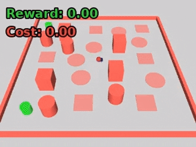
</p>

## Features

- **Massively parallel simulation**: Train agents across thousands of environments simultaneously on GPU/TPU
- **Configurable difficulty levels**: Environments with varying numbers and types of hazards
- **Multiple constraint types**: Cylindrical hazards, cubical hazards, boundary constraints, velocity limits, and more
- **State-of-the-art algorithms**: Implementations of leading constrained RL methods

## Safe RL Algorithms

CRAX includes efficient JAX implementations of:

| Algorithm | Description | Reference |
|-----------|-------------|-----------|
| **PPO-Lagrange** | PPO with Lagrangian relaxation for constraints | [Ray et al., 2019](https://cdn.openai.com/safexp-short.pdf) |
| **PPO-PID** | PPO with PID-controlled Lagrange multiplier | [Stooke et al., 2020](https://arxiv.org/abs/2007.03964) |
| **FOCOPS** | First Order Constrained Optimization in Policy Space | [Zhang et al., 2020](https://arxiv.org/abs/2002.06506) |
| **P3O** | Penalized Proximal Policy Optimization | [Zhang et al., 2022](https://arxiv.org/abs/2205.11814) |
| **PPO-Saute** | State Augmentation for Safe RL | [Sootla et al., 2022](https://arxiv.org/abs/2202.06558) |

All algorithms share a common training infrastructure with hooks for custom loss functions and constraint handling, making it easy to implement new methods.

## Environments

CRAX environments follow a **task-agent** naming convention: `safe_<task>_<agent>`.

| Task | Agents Supported                                      | Description                                              |
|------|-------------------------------------------------------|----------------------------------------------------------|
| **Goal** | Point, Ant, Spider, Humanoid, Swimmer                 | Navigate to goal positions while avoiding hazards        |
| **Circle** | Point, Ant, Spider, Humanoid, Swimmer                 | Orbit a circular path within boundaries                  |
| **Button** | Point, Ant, Spider, Humanoid, Swimmer                 | Press target buttons while avoiding gremlins and hazards |
| **Push** | Point, Ant, Spider, Humanoid, Swimmer                 | Push a block to a goal while avoiding hazards            |
| **Velocity** | Ant, Humanoid, HalfCheetah, Hopper, Swimmer, Walker2D | Locomotion under maximum velocity constraints            |
| **Lift** | Ant, Humanoid, Spider                                 | Locomotion with restricted legs touching the floor        |
| **Height** | Humanoid, HalfCheetah, Hopper, Walker2D               | Locomotion under a height ceiling                        |
| **Pathway** | HalfCheetah, Hopper, Walker2D                         | Traverse a corridor with hazard gaps                     |
| **Reacher** | Reacher                                               | Robotic arm reaching targets while avoiding obstacles    |

## Difficulty Levels

Every environment offers three difficulty levels that progressively increase constraint difficulty.

| Environment | Level 1 | Level 2 | Level 3 |
|:-----------:|:-------:|:-------:|:-------:|
| **Goal** | 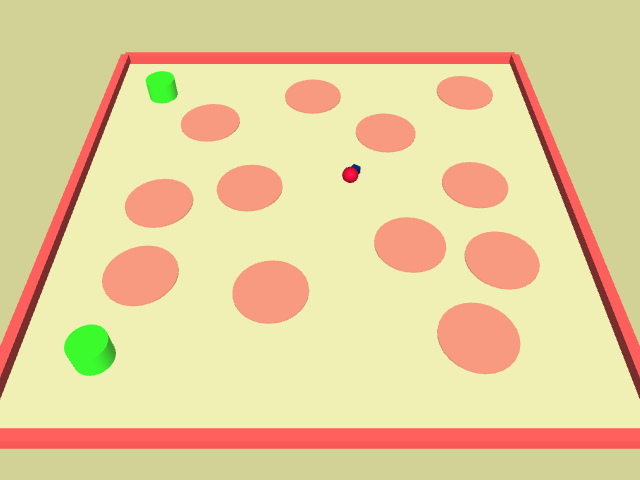 | 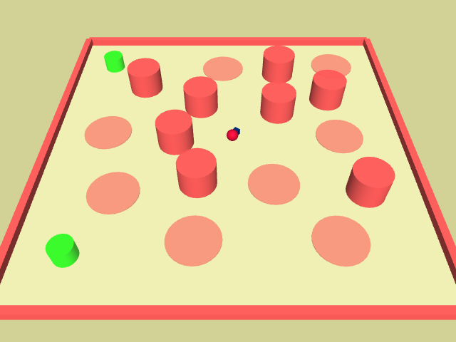 | 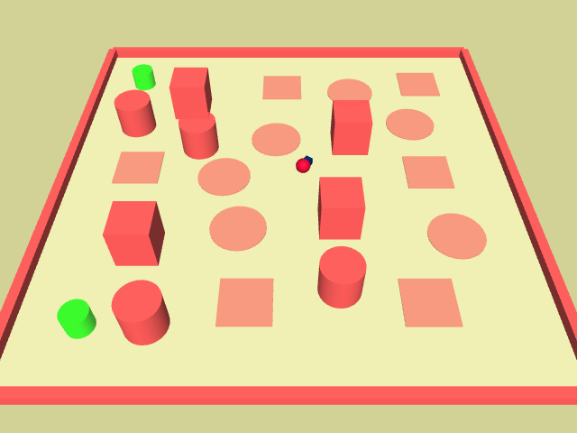 |
| **Circle** |  |  | 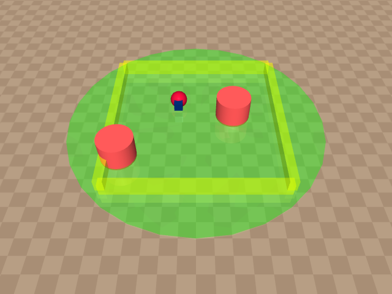 |
| **Push** |  |  | 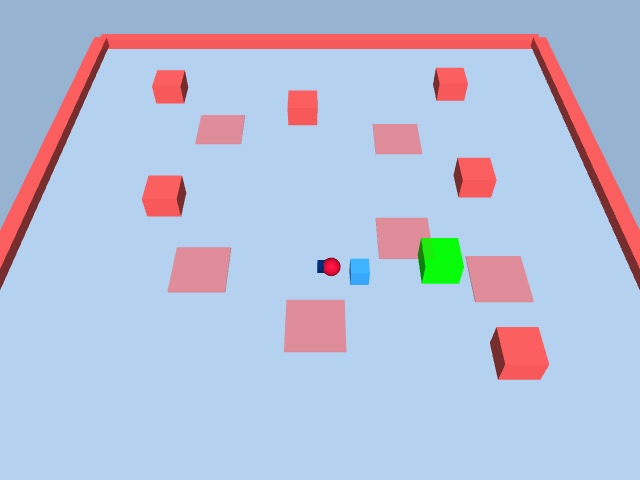 |
| **Reacher** | 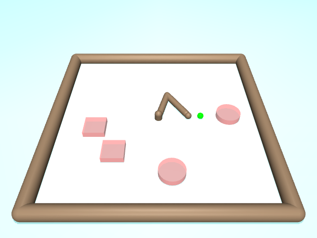 | 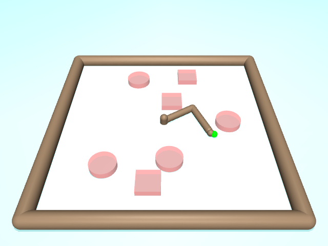 | 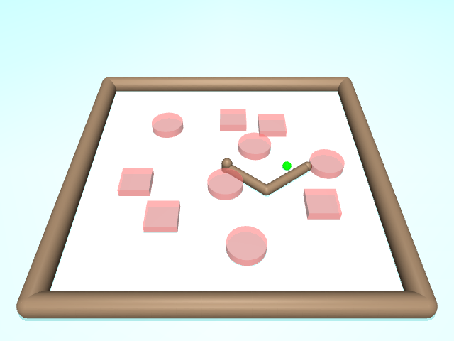 |
| **Pathway** | 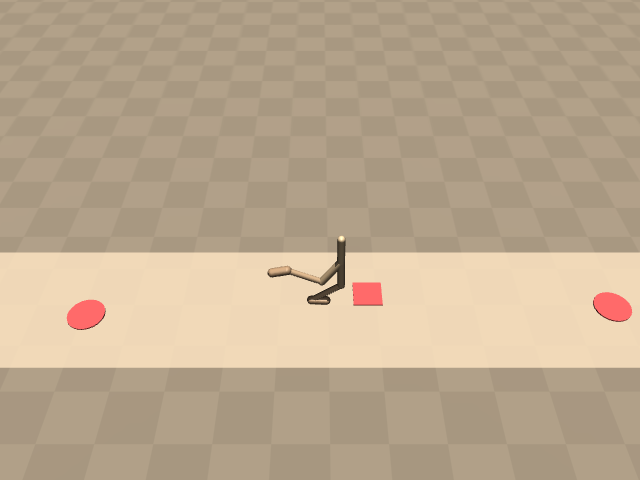 |  | 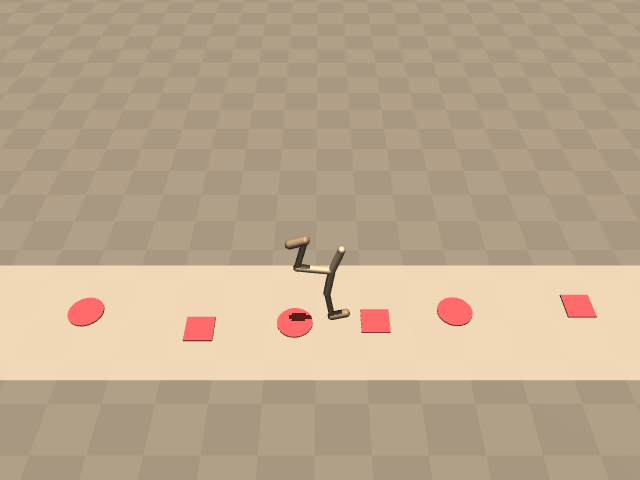 |
| **Height** | 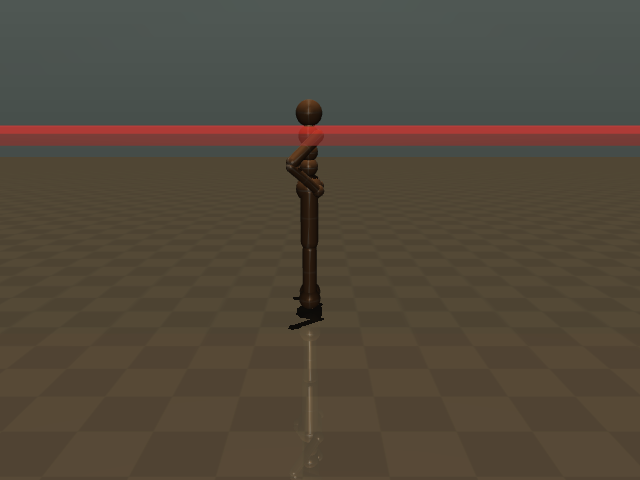 |  | 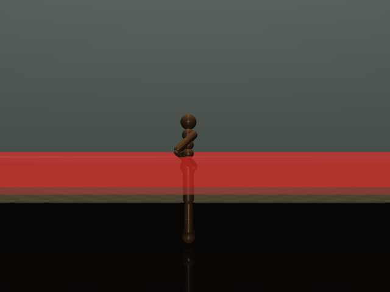 |
| **Lift** | 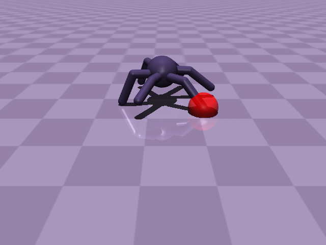 | 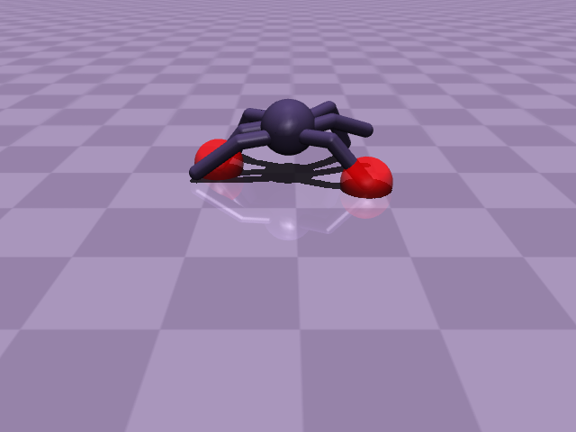 | 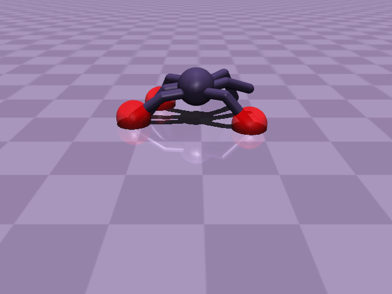 |

## Installation

```bash
git clone https://github.com/your-repo/CRAX.git
cd CRAX
```

Create and activate a virtual environment using your preferred tool:

```bash
# Option A: venv
python3 -m venv .venv && source .venv/bin/activate

# Option B: conda
conda create -n crax python=3.11 && conda activate crax
```

Then install the package:

```bash
pip install -e .
```

For GPU support, ensure you have [CUDA and JAX with GPU support](https://github.com/google/jax#installation) installed.

## Quick Start

### Training an agent

```python
from brax import envs
from brax.training.agents.ppo_lag import train as ppo_lag_train

# Create environment
env = envs.get_environment('safe_goal_point', level=1)

# Train with PPO-Lagrange
make_policy, params, metrics, _ = ppo_lag_train.train(
    environment=env,
    num_timesteps=10_000_000,
    episode_length=1000,
    num_envs=2048,
    safety_bound=25.0,  # Maximum allowed cost per episode
    lagrangian_coef_rate=0.01,
)
```

### Using the CLI

```bash
# Single environment training
python train_env.py --env_name safe_goal_point --alg ppo_lag --difficulty 1

# Curriculum training (progressive difficulty)
python train_curriculum.py --env_name safe_goal_point --alg ppo_lag

# Safety transfer (pre-train with PPO, then fine-tune with safe algorithms)
python train_transfer.py --env_name safe_velocity_ant --alg ppo_lag
```

## Project Structure

```
CRAX/
├── brax/
│   ├── envs/                    # Environment definitions
│   │   ├── safe_goal.py         # Goal navigation suite
│   │   ├── safe_circle.py       # Circular orbit suite
│   │   ├── safe_button.py       # Button pressing suite
│   │   ├── safe_push.py         # Block pushing suite
│   │   ├── safe_velocity.py     # Velocity constraint suite (6 agents)
│   │   ├── safe_lift.py         # Leg-lifting suite
│   │   ├── safe_height.py       # Height constraint suite
│   │   ├── safe_pathway.py      # Hazard corridor suite
│   │   ├── safe_reacher.py      # Reacher with obstacles
│   │   ├── safe_spider.py       # Spider leg-lifting
│   │   ├── builder.py           # Modular XML scene builder
│   │   ├── difficulty.py        # Difficulty level configurations
│   │   ├── hazards.py           # Hazard generation utilities
│   │   └── goals.py             # Goal sampling utilities
│   └── training/
│       └── agents/
│           ├── ppo/             # Base PPO with extensibility hooks
│           ├── ppo_lag/         # PPO-Lagrange
│           ├── ppo_pid/         # PPO with PID controller
│           ├── focops/          # FOCOPS
│           ├── p3o/             # P3O
│           └── ppo_saute/       # Saute wrapper
├── configs/                     # Training configurations
├── train_env.py                 # Single environment training
├── train_curriculum.py          # Progressive difficulty training
├── train_transfer.py            # Safety transfer learning
└── scripts/                     # Utility & visualization scripts
```

## Architecture

CRAX uses a modular architecture where constrained RL algorithms are thin wrappers around a base PPO trainer:

```
ppo/train.py          # Base trainer with hooks (loss_fn, post_step_fn, init_aux_state_fn)
    │
    ├── ppo_lag/      # Lagrange multiplier update + lagrange loss
    ├── ppo_pid/      # PID controller + lagrange loss
    ├── focops/       # FOCOPS loss + nu update
    ├── p3o/          # P3O loss + kappa adaptation
    └── ppo_saute/    # Environment wrapper approach
```

This design minimizes code duplication and makes it easy to add new algorithms.

[//]: # (## Acknowledgements)

[//]: # ()
[//]: # (CRAX is built on top of [Brax]&#40;https://github.com/google/brax&#41;, a differentiable physics engine by Google. We thank the Brax team for their excellent foundation.)

[//]: # ()
[//]: # (If you use CRAX in your research, please cite:)

[//]: # ()
[//]: # (```bibtex)

[//]: # (@software{crax2025,)

[//]: # (  title = {CRAX: Constrained Reinforcement Learning Accelerated with JAX},)

[//]: # (  year = {2025},)

[//]: # (})

[//]: # (```)
